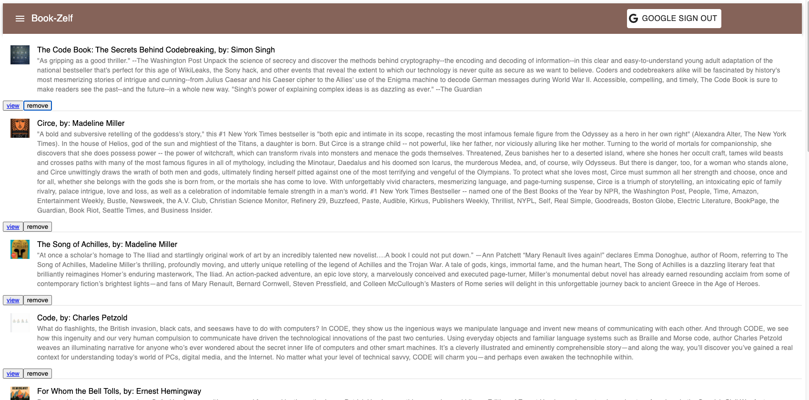

# book-search
This application searchs the google books api and returns books with titles associated to the text entered. Users may go visit the book on the Google books marketplace or save the listing provided to their very own shelf. The shelf displays the different books that have been saved to it. It is a great way to keep track of books you may want to read in the future. 

### Live-Site url: https://book-zelf.herokuapp.com/

### Search Page: 
Any visitor to the site may search books but in order to save the books to a personal shelf the user must have a gmail account. After the user signs in they will be able to click the save button which will save the book to their shelf. To navigate to the saved page a user can click on the link in the hamburger menu on the top right of the page. The books also have a view option which when clicked will take a user to the Google Books marketplace page for that book. 

### Saved Page: 
The saved page is also known as the shelf and displays the users saved books. Users may delete books from the shelf by clicking the remove button. There is also the option to go view the book on the Google Books marketplace.

### Technology Used:
* React
* Material-Ui
* MongoDB
* Express
* Node
* Mongoose
* Google Books API
* Google OAuth
