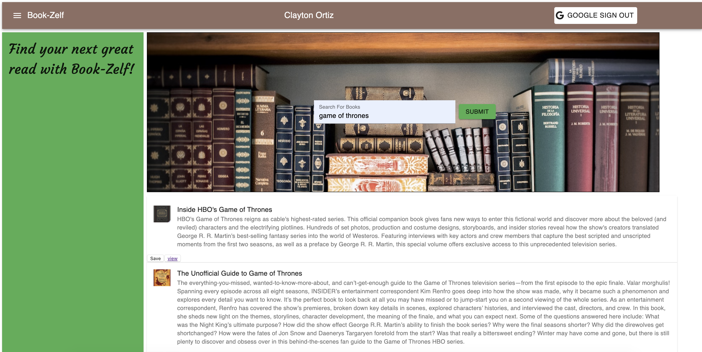

# book-search
This application searchs the google books api and returns books with titles associated to the text entered. Users may go visit the book on the google books marketplace or save the listing provided to their very own shelf. The shelf displays the different books that have been saved to it. It is a great way to keep track of books you may want to read in the future. 

### Live-Site url: https://book-zelf.herokuapp.com/

### Search Page: 
Any visitor to the site may search books but in order to save the books to a personal shelf the user must be logged in.

### Saved Page: 
The saved page is also known as the shelf and displays the users saved books. 
